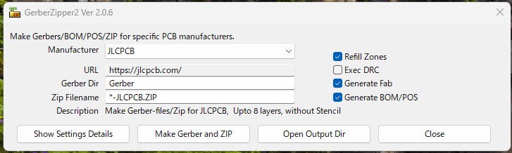
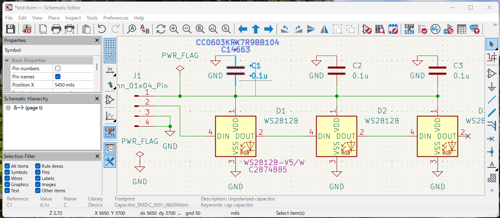
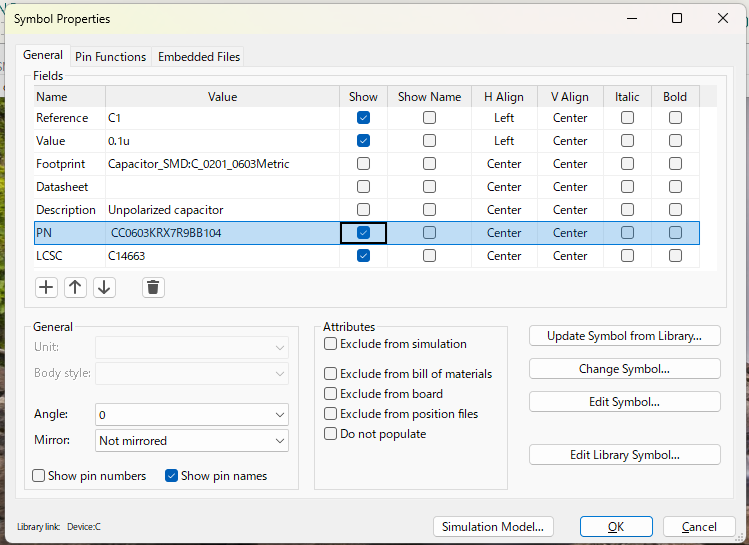
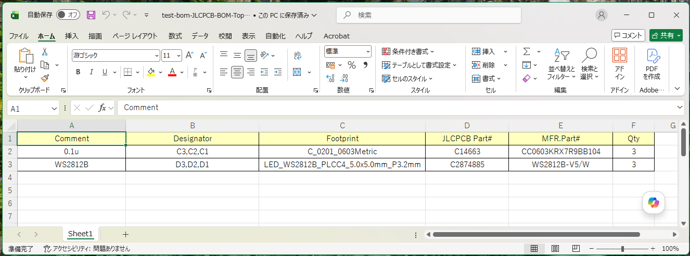

# kicad-gerberzipper2

## Overview
[English](#overview) | [日本語](#概要)

When launched from the KiCad PCB editor, it outputs Gerber files with parameters set for each PCB supplier, bundles them into a ZIP file, and creates BOM and POS files for PCBA. It also runs DRC and outputs a PDF for Fab.

This is the IPC API-compatible version of GerberZipper. Instead of the previous SWIG API, it uses the IPC API and the command-line kicad-cli supported by KiCad 9.x and later.

## Usage  

* Launch from the KiCad PCB Editor toolbar.

* Though it should be set up automatically during installation, you need to have [Enable KiCad API] checked in the [Plugins] tab under [Preferences]-[Preferences...].

* Select the target PCB manufacturer under [Manufacturer].

* Click the [Make Gerber and ZIP] button to perform the following steps in sequence:
  - Refill zones
  - Exec DRC
  - Generate PDF for Fabrication
  - Generate BOM/POS files  

* The output will be saved in the directory specified by [Gerber Dir], which is located under the directory containing the target kicad_pcb file.

  

* Click the [Open Output Dir] button to open the target output directory.  
* Click the [Show Settings Details] button to view the configuration details.  
If you want to create your own custom Gerber/ZIP files, navigate to the directory accessible via the [Open Settings Folder] button on the details screen, review the other `Manufacturers/*.json` files there, and create a new `.json` file.
* BOM and POS files accept any of the following file extensions: .csv, .xlsx, or .txt.
* If you enter the part number in the [PN] field and the LCSC number in the [LCSC] field as attributes for each component in the schematic, these values will be automatically imported when generating a BOM using settings for certain manufacturers.  


For example, if you configure the fields using the settings shown above, the resulting BOM will look like the figure below.


## Note

* Immediately after installation, the process of copying necessary files and other tasks may still be in progress in the background. If the program does not start properly, try closing KiCad and restarting it. 
* Unlike old SWIG API plugins, the IPC API plugin runs as a separate process from the KiCad core. To maintain the correspondence between the plugin and the KiCad core, it is currently assumed that only one KiCad PCB editor is launched and the plugin is launched from the PCB editor. Also, it is assumed that the PCB opened corresponds to the project file open in KiCad.
* Due to differences in API functionality, there are the following differences from the old version of GerberZipper:
  - No "ForcePlotInvisible" setting. This function will also be removed from the KiCad core in 9.0.1 and later.
  - No "ExcludeEdgeLayer" setting. This function has already been discontinued in the KiCad core. Recent versions of KiCad have "PlotOnAllLayers," which offers equivalent or greater flexibility.
  - No "ExcludePadsFromSilk" setting. This function is a Fab-only function that has already been discontinued in the KiCad core. Recent versions of KiCad allow you to set "Sketch pads on fabrication layers" instead.
  - The "DoNotTentVias" setting is missing. This feature, which enabled/disabled tenting for vias across the entire PCB, has been discontinued. Currently, it can be controlled individually for each via.
  - The "LineWidth" setting is missing. This setting has also been discontinued. The history is too old to fully understand. Probably around version 6.x.
* If using with Ubuntu, you will likely need to install the following modules.
```
  $ sudo apt install python3-pip  
  $ sudo apt install ptyhon3-venv  
  $ sudo apt install python3-wxgtk4.0  
```

## History
2.0.6 Support drill report / Optional files / xlsx output  
2.0.5 WSLg workaround / xlsx output  
2.0.4 Fix bug about language setting  
2.0.3 Update metadata for IPC plugin / Fixed minor bugs  
2.0.2 Fix temp filename  
2.0.1 Fix Mac/Ubuntu GUI, PCM related issues  
2.0.0 First release  

---
---

## 概要

[English](#overview) | [日本語](#概要)

KiCad の PCB エディターから起動すると各 PCB 業者向けにパラメータを設定したガーバーを出力して ZIP ファイルにまとめ、また PCBA 用の BOM および POS ファイルを作成します。また、DRC の実行、Fab 用 PDF の出力も行います。

これは GerberZipper の IPC API 対応版です。これまでの SWIG 版 API ではなく、KiCad 9.x 以降でサポートされる IPC API および コマンドラインの kicad-cli を使用しています。

## 使い方

* KiCad の PCB エディターのツールバーから起動してください。
* インストールの際に自動的に設定されるはずですが、動作には [ 設定 ]-[ 設定... ] 内 [ プラグイン ] タブで [ KiCad API を有効にする ] がチェックされている必要があります。
* [ 基板メーカー ] で対象のPCBメーカーを選択します
* [ガーバー/ZIP ファイル作成] ボタンで以下を順次実行します。
  - ゾーンの再塗潰し
  - DRC の実行
  - Fab 用の PDF 出力
  - BOM/POS ファイルの出力  
 
* 出力は対象の kicad_pcb ファイルがあるディレクトリ下の [ ガーバーディレクトリ ] で示されるディレクトリになります。

  
* [ 出力フォルダーを開く ] ボタンで対象の出力ディレクトリを開けます。  
* [ 設定の詳細を表示 ]ボタンで設定の詳細が表示されます。  
自分で設定したガーバー/ZIPファイルを作成したい場合は、詳細画面内の [ 設定ファイルフォルダーを開く ] ボタンからアクセスできるディレクトリ下で他の `Manufacturers/*.json` ファイルを参照して新たな `.json` ファイルを作成してください。

* BOM および POS ファイルは拡張子として .csv、.xlsx、.txt のいずれかを受け入れます。

* 回路図内の各部品の属性として [ PN ] フィールドに部品の品番、[ LCSC ] フィールドに LCSC の品番を入れておくと、一部のメーカー向けの設定で BOM を生成した時に自動的に取り込まれます。  


例えば上のような設定でフィールドを設定しておいた時に生成されるBOMが下の図のようになります。


## 注意

* インストールした直後はバックグラウンドでまだ必要なファイルのコピー等が進行途中の場合があります。正常に起動できない場合、一度 KiCad を終了して再起動してみてください。  

* これまでのプラグインとは違い IPC API プラグインは KiCad 本体とは別のプロセスになります。 プラグインと KiCad 本体との対応関係を維持するため、今のところは KiCad の PCB エディタを1つだけ起動して、PCB エディタから起動する事を想定しています。 また、開く PCB は KiCad で開いているプロジェクトファイルと対応が取れているものとします。 

* API の機能の違いにより、旧版の GerberZipper とは次のような違いがあります。
  - "ForcePlotInvisible" 設定がない。この機能は KiCad 本体からも 9.0.1 以降で削除される。
  - "ExcludeEdgeLayer" 設定がない。この機能は KiCad 本体で既に廃止。最近の KiCad は同等以上の柔軟性のある"PlotOnAllLayers"がある。
  - "ExcludePadsFromSilk" 設定がない。この機能は KiCad 本体で既に廃止された Fab 用の機能。最近の KiCad は代わりに"Sketch pads on fabrication layers"が設定できる。
  - "DoNotTentVias" 設定がない。この機能は PCB 全体の Via のテントをOn/Offするものだったが既に廃止。現在は Via 個別に制御できる。
  - "LineWidth" 設定がない。この設定は既に廃止されている。経緯が古すぎて良くわからない。多分 Ver 6.x の頃。
* Ubuntu で使用する場合は以下のモジュールをインストールしておく必要がありそうです。
```
  $ sudo apt install python3-pip  
  $ sudo apt install ptyhon3-venv  
  $ sudo apt install python3-wxgtk4.0  
```

## 履歴
2.0.6 Support drill report / Optional files / xlsx output  
2.0.5 WSLg workaround / xlsx output  
2.0.4 Fix bug about language setting  
2.0.3 Update metadata for IPC plugin / Fixed minor bugs  
2.0.2 Fix temp filename  
2.0.1 Fix Mac/Ubuntu GUI, PCM related issues  
2.0.0 First release  

